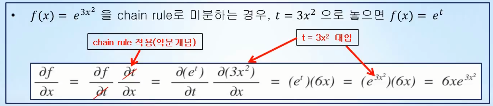
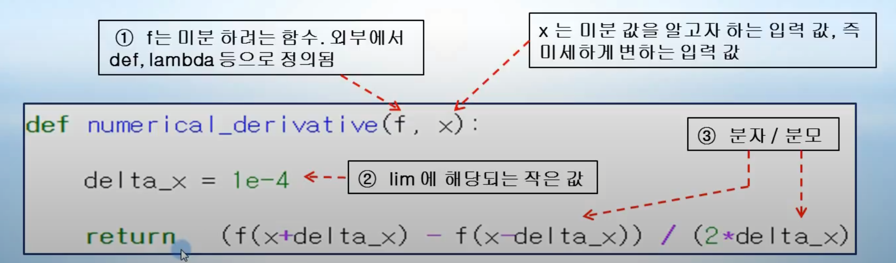

# Day02_수치미분


- 미분과 편미분은 머신러닝에서 사용되는 일차함수의 기울기와 y절편을 계산하고 최적화시키기위해 반드시 필요한 개념이다.
- 편미분과 체인룰은 머신러닝에서 가중치를 업데이트하고 오차역전파(Backpropagation)에서 사용하는 것으로 중요하다.


- ### 미분

  - 함수를 미분한다는 것은 입력변수 x가 미세하게 변할 때, 함수 f가 얼마나 변하는지 알 수 있는 식을 구하라는 의미
  - 또는 함수 f(x)는 입력 x의 미세한 변화에 얼마나 민감하게 반응하는지 알 수 있는 식을 구해라는 의미
    - ex) 함수 f(x) = x^2일 경우, 미분 f'(x) = 2x
      - f(3) = 9 해석
        - 입력 x=3을 넣으면 출력은 9가 된다는 의미
      - f'(3) = 6 해석
        - 입력 x=3을 미세하게 변화시킬 때 함수는 현재 입력 값의 2배인 6의 변화를 일으킨다는 의미
  - 머신러닝 / 딥러닝에서 자주 사용되는 함수의 미분
    - f(x) = 상수 => f'(x) = 0
    - f(x) = e^x => f'(x) = e^x
    - f(x) = e^-x => f'(x) = -e^-x  
    - f(x) =ax^n => f'(x) = nax^n-1
    - f(x) = lnx => f'(x) = 1/x 


- ### 편미분

  - 입력변수가 하나 이상인 다변수 함수에서, 미분하고자 하는 변수 하나를 제외한 나머지 변수들은 상수로 취급하고, 해당 변수를 미분하는 것
    - ex) f(x,y) = 2x + 3xy + y^3를 x에 대해 편미분 하면 2 + 3y 가 되고 y에 대해 편미분 하면 3x + 3y^2이 된다.


- ### 연쇄법칙 (chain rule)

  - 합성함수란 여러 함수로 구성된 함수이다
  - 합성함수를 미분하려면 '합성함수를 구성하는 각 함수의 미분의 곱'으로 나타내는 chain rule을 이용한다.
  - 


- ### 수치미분(numerical derivative)

  - 수학공식을 쓰지 않고 C / 파이썬 등을 이용하여, 주어진 입력 값이 미세하게 변할 때 함수 값 f 는 얼마나 변하는지를 계산 해주는 것을 지칭한다.
  - 수치미분을 구현하는 3단계 과정
    1. 미분하려는 함수 f(x) 정의
    2. 극한 개념을 구현하기 위해 델타x는 작은 값으로 설정
    3. 분자 / 분모 구현
  - 

  

  - 수치미분 최종 버전

    - 입력 변수가 하나 이상인 다 변수 함수의 경우, 입력변수는 서로 독립적이기 때문에 수치미분 또한 변수의 개수만큼 개별적으로 계산하여야 한다.

    - ```python
      import numpy as np
      
      def numerical_derivative(f, x): #f: 다변수 함수 x: 모든 변수를 포함하고 있는 numpy 객체 (배열, 행렬, ...)
          delta_x = 1e-4
          grad = np.zeros_like(x) # 계산된 수치미분 값 저장 변수
          
          it = np.nditer(x, flags=['multi_index'], op_flags=['readwrite']) 
          # 모든 입력 변수에 대해 편미분하기 위해 iterator 획득
          
          while not it.finished: # 변수의 개수 만큼 반복
              idx = it.multi_index
              
              tmp_val = x[idx] # numpy 타입은 mutable 이므로 원래 값 보관
              x[idx] = float(tmp_val) + delta_x
              fx1 = f(x)
              
              x[idx] = tmp_val - delta_x
              fx2 = f(x)
              grad[idx] = (fx1 - fx2) / (2*delta_x) # 하나의 변수에 대한 수치미분 계산(기존코드와 동일)
              
              x[idx] = tmp_val
              it.iternext()
              
          return grad     
      ```

      

