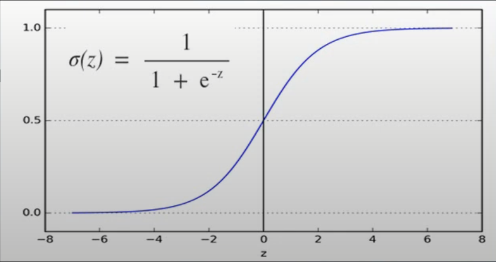

# Day03_머신러닝


- 머신러닝 학습방법
  - 지도학습(Supervised)
    - 학습할 데이터의 입력과 그 입력에 대응되는 정답에 대해서 데이터의 특성과 분포를 학습하고 미래 결과를 예측하는 방법
    - 종류
      - 회귀(Regression)
      - 분류(Classification)
  - 비지도학습(Unsupervised)
    - 학습할 데이터의 정답은 없고 입력값만 있다
    - 정답이 없는 입력 데이터만 이용하기 때문에 입력값들의 특성과 분포만을 파악해서 그룹핑하는 방법
    - 종류
      - 군집화(Clustering)


- ### 지도학습

  - 입력 값(X)과 정답 (t, label)을 포함하는 Training Data를 이용하여 학습하고, 그 학습된 결과를 바탕으로 미지의 데이터(Test Data)에 대해 미래 값을 예측(predict) 하는 방법
  - 대부분 머신러닝 문제는 지도학습에 해당된다.
  - 학습결과를 바탕으로, 미래의 무엇을 예측하느냐에 따라 회귀, 분류 등으로 구분할 수 있다.
  - 회귀
    - Training Data를 이용하여 연속적인 (숫자) 값을 예측하는 것을 말하며, 집평수와 가격 관계, 공부시간과 시험성적 등의 관계이다.
  - 분류
    - Training Data를 이용하여 주어진 입력값이 어떤 종류의 값인지 구별하는 것을 지칭한다.


- ### 비지도학습

  - Training Data에 정답은 없고 입력 데이터만 있기 때문에, 입력에 대한 정답을 찾는 것이 아닌 입력데이터의 패턴, 특성 등을 학습을 통해 발견하는 방법을 말한다.
    - ex) 군집화 알고리즘을 이용한 뉴스 그룹핑, 백화점의 상품 추천시스템 등


- ### Linear Regression (선형 회귀)

  - #### 회귀

    - Training Data를 이용하여 데이터의 특성과 상관관계 등을 파악하고, 그 결과를 바탕으로 Training Data에 없는 미지의 데이터가 주어졌을 경우에 그 결과를 연속적인 (숫자) 값으로 예측하는 것

  - #### 회귀에서 학습의 개념

    - Training Data를 먼저 분석하고 그 데이터의 분포를 가장 잘 나타내는 일차함수의 기울기(가중치)와 y절편(바이어스)을 찾는 과정이다.
    - 머신러닝에서는, 기울기를 가중치(weight), y절편을 바이어스(bias)라고 한다.

  - #### 오차(error)

    - 실제 데이터 값과 일차함수의 값과의 차이
    - 오차 = t - y = t - (Wx+b)로 계산된다.
    - 오차가 크다면, 울리가 임의로 설정한 직선의 가중치와 바이어스 값이 잘못된 것이고, 오차가 작다면 직선의 가중치와 바이어스 값이 잘 된 것이기 때문에 미래 값 예측도 정확할 수 있다고 예상할 수 있다.

  - 모든 데이터의 오차가 최소가 돼서, 미래 값을 잘 예측할 수 있는 가중치와 바이어스 값을 찾는 것이 머신러닝 회귀 시스템의 핵심이다.

  - #### 손실함수 (loss function or cost function)

    - training data의 정답(t)과 입력(x)에 대한 계산 값 y의 차이를 모두 더해 수식으로 나타낸 것 

    - 

    - 각각의 오차를 모두 더해서 손실함수를 구하면 각각의 오차가 (+), (-)등이 동시에 존재하기 때문에 오차의 합이 0이 나올 수도 있다. (즉, 0이라는 것이 최소 오차 값인지 아닌지를 판별하는 것이 어렵다.)

    - 그래서 손실함수에서 오차를 계산할 때는 (t-y)^2 = (t-[Wx+b])^2을 사용한다. 

      (즉 오차는 언제나 양수이며, 제곱을 하기때문에 정답과 계산값 차이가 크다면, 제곱에 의해 오차는 더 큰값을 가지게 되어 머신러닝 학습에 있어 장점을 가진다.)

    - x와 t는 training Data에서 주어지는 값이므로, 손실함수인 E(W,b)는 결국 W와 b에 영향을 받는 함수이다.

    - E(W,b) 값이 작다는 것은 정답과 일차함수에 의해 계산된 값의 평균 오차가 작다는 의미이다.

    - 평균오차가 작다는 것은 미지의 데이터 x가 주어질 경우, 확률적으로 미래의 결과값도 오차가 작을 것이라고 추측할 수 있다.

    - 이처럼 training Data를 바탕으로 손실 함수 E(W,b)가 최소값을 갖도록 (W,b)를 구하는 것이 (linear) regression model의 최종 목적이다.

  - ####  경사하강법 (gradient decent algorithm)

    - 손실함수의 최소값을 찾을 수 있는 방법
    - 계산을 쉽게 하고 손실함수의 모양을 파악하기 위해 E(W,b)에서 바이어스 b = 0으로 가정한다.
      - W값에 대한 손실함수 E(W,b) 계산
      - 
  
    - 경사하강법 원리 
      1. 임의의 가중치 W를 선택한다.
      2. 그 W에서의 직선의 기울기를 나타내는 미분 값을 구한다.
      3. 그 미분 값이 작아지는 방향으로 W 감소(또는 증가) 시켜 나간다.
      4. 최종적으로 기울기가 더 이상 작아지지 않는 곳을 찾을 수 있는데, 그 곳이 손실함수 E의 최소값임을 알 수 있다.
    - W에서의 직선의 기울기인 미분 값을 이용하여, 그 값이 작아지는 방향으로 진행하여 손실함수 최소값을 찾는 방법을 경사하강법이라고 한다.
    - W 값 구하기
      - W 에서의 편미분 해당 W에서 기울기(slope)를 나타낸다.
      - 편미분이 양수 값을 갖는다면 W는 왼쪽으로 이동시켜야만(감소), 손실함수 E(W)의 최소값을 찾는다.
      - 편미분이 음수값을 갖는다면 W는 오른쪽으로 이동시켜야만(증가), 손실함수 E(W)의 최소값을 찾는다.
      - 
      - a(알파)는 학습율 (learning rate)이라고 부르며, W값의 감소 또는 증가 되는 비율을 나타낸다.
    - b 값 구하기
      - 바이어스 역시 구하는 방법은 같다.
      - 
  
  - #### 최적의 [W,b] 계산 프로세스
  
    - 

​				

- ### linear regression을 파이썬에서 사용하기

  - 총 5단계가 있다.
    1. 슬라이싱 또는 list comprehension등을 이용해서 입력 x 와 정답 t 를 numpy 데이터형으로 분리한다.
    2. W, b를 numpy.random.rand()를 이용해서 정의해준다.
    3. 손실함수를 계산하는 함수를 만들어 준다.
    4. 학습률 a 를 지정해준다.
    5. W,b를 업데이트 해주는 로직을 짜준다.
  - 오차를 계산하기 위해서는 training Data의 모든 입력 x에 대해 각각의 y = Wx+b 계산을 해야 한다.
  - 이때 입력 x, 정답 t, 가중치 W 모두를 행렬로 나타낸 후에, 행렬 곱(dot product)을 이용하면 계산 값 y 또한 행렬로 포시되어 모든 입력 데이터에 대해 한번에 쉽게 계산되는 것을 알 수 있다. 


- ### Logistic Regression

  - #### 분류 (Clssification)

    - Training Data 특성과 관계 등을 파악 한 후에, 미지의 입력 데이터에 대해서 결과가 어떤 종류의 값으로 분류 될 수 있는지를 예측하는 것
    - ex) 스팸문자 분류, 암 판별

  - logistic Regression 알고리즘

    1. Training Data 특성과 분포를 나타내는 최적의 직선을 찾는다.
    2. 그 직선을 기준으로 데이터를 위 또는 아래 등으로 분류 해주는 알고리즘

  - 이러한 Logistic Regression은 Classification 알고리즘 중에서도 정확도가 높은 알고리즘으로 알려져 있어서 딥러닝에서 기본 Component로 사용되고 있다.

  - #### sigmoid function

    - 출력 값 y가 1 또는 0만을 가져야만 하는 분류 시스템에서, 함수 값으로 0~1 사이의 값을 가지는 sigmoid 함수를 사용할 수 있다.
    - 즉, linear regression 출력 Wx+b가 어떤 값을 갖더라도, 출력 함수로 sigmoid를 사용할 수 있다.
      1. sigmoid 계산 값이 0.5보다 크면 결과로 1이 나올 확률이 높다는 것이기 때문에 출력 값 y는 1을 정의한다.
      2. sigmoid 계산이 0.5 미만이면 결과로 0이 나올 확률이 높다는 것이므로 출력 값 y는 0을 정의한다.
      3. 이렇게 classification 시스템을 구현할 수 있다.
    - 
    - sigmoid 함수의  실제 계산 값 sigmoid(z)는 결과가 나타날 확률을 의미한다.

  - #### 손실함수

    - 논리적으로 1 또는 0 값을 가지기 때문에, 선형회귀 때와는 다른 손실함수가 필요하다.
    - 이러한 Classification의 손실함수를 cross-entropy라고 한다.
    - 
    - cross-entropy 유도
      - classification 최종 출력 값 y 는 sigmoid 함수에 의해 0~1사이의 값을 갖는 확률적인 분류 모델이므로, 다음과 같이 확률변수 C를 이용해 출력 값을 나타낼 수 있다.
      - 

  - #### Classification 에서의 [W,b] 계산 프로세스

    - 

  - ### Logistic regression을 파이썬에서 사용하기

    - 총 5단계가 있다.
      1. 슬라이싱 또는 list comprehension등을 이용해서 입력 x 와 정답 t 를 numpy 데이터형으로 분리한다.
      2. W, b를 numpy.random.rand()를 이용해서 정의해준다.
      3. 손실함수를 계산하는 함수를 만들어 준다. (이 부분이 linear와 다르다.)
      4. 학습률 a 를 지정해준다.
      5. W,b를 업데이트 해주는 로직을 짜준다.


- ### 논리게이트 - AND, OR, NAND, XOR

  - 논리테이블은 입력데이터, 정답데이터인 머신러닝 Training Data와 개념적으로 동일하다.

  - 즉, 논리게이트는 손실함수로 cross-entropy를 이용해서 Logistic Regression 알고리즘으로 데이터를 분류 하고 결과를 예측할 수 있다.

  - #### 논리게이트 검증을 위한 코드

    - 3부분으로 나눌 수 있다.

      - external function

      - ```python
        def sigmoid(x):  # 0 또는 1을 출력하기 위한 sigmoid 함수
            
        def numerical_derivative(f,x): # 수치미분함수
        ```

      - LogicGate class

      - ```python
        class LogicGate:
            def __init__(self, gate_name, xdata, tdata) # __xdata, __tdata, __W, __b 초기화
            def __loss_func(self) # 손실함수 cross-entropy
            def error_val(self) # 손실함수 값 계산
            def train(self) # 수치미분을 이용하여 손실함수 최소값 찾는 method
            def predict(self, xdata) # 미래 값 예측 method
        ```

      - usage

      - ```python
        xdata = np.array([[0,0], [0,1], [1,0], [1,1]]) # 입력 데이터 생성
        tdata = np.array([0,0,0,1]) # 정답 데이터 생성(AND 예시)
        
        AND_obj = LogicGate("AND_GATE", xdata, tdata) # LogicGate 객체생성
        AND_obj.train() # 손실함수 최소값 갖도록 학습
        
        AND_obj.predict(...) # 임의 데이터에 대해 결과 예측
        ```

  - XOR 게이트는 Logistic Regression 알고리즘으로 데이터를 분류할 수 없을 것 같다.

  - #### XOR 구현

    - NAND, OR, AND 조합으로 XOR을 구현한다.

    - x1, x2의 2개의 입력을 NAND를 거치면 S1, OR을 거치면 S2라고 하고 이러한 S1, S2를 AND의 입력으로 주어 최종 출력 y 값을 얻을 수 있다.

    - 머신러닝 XOR 문제는 다양한 Gate 조합인 Multi-Layer로 해결할 수 있다.

    - 각각의 Gate(NAND, OR, AND)는 Logistic Regression 시스템으로 구성 된다.

    - 이전 Gate의 모든 출력은 다음 Gate 입력으로 들어간다.

      - #### 신경망 기반의 딥러닝 핵심 아이디어이다.


