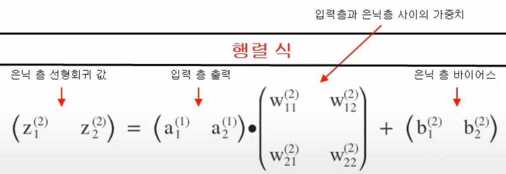
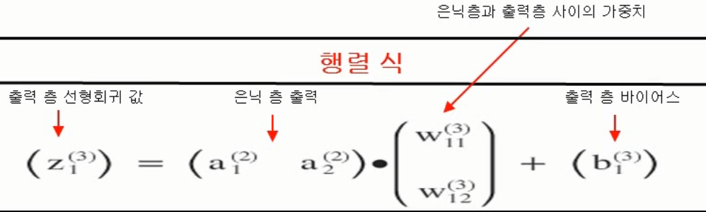
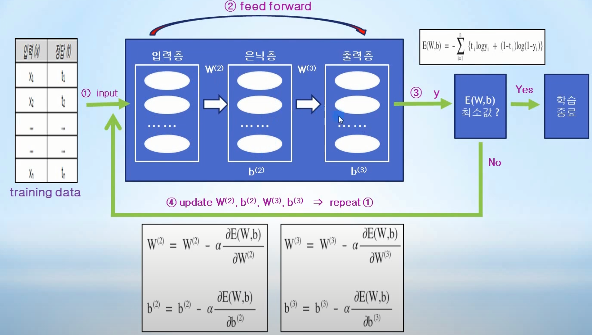
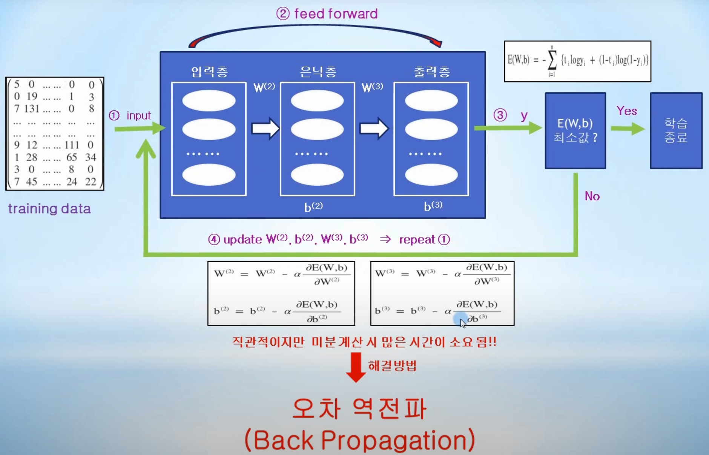

# Day04_딥러닝


- ### 신경망 (Neural Network)

  - 인간의 신경세포 뉴런으로 연결된 신경망 동작원리와 유사하다.

  - 신경 세포 뉴런은 이전 뉴런으로부터 입력신호를 받아 또 다른 신호를 발생시킨다.

  - 그러나 입력에 비례해서 출력을 내는 형태가 아니라, 입력 값들의 모든 합이 어느 임계점에 도달해야만 출력 신호를 발생시킨다.

  - #### 활성화 함수

    - 입력신호를 받아 특정 값의 임계점을 넘어서는 경우에, 출력을 생성해주는 함수
    - 지금까지 사용해왔던 Logistic Regression 시스템의 sigmoid 함수가 대표적인 활성화 함수(activation function)이다.
    - 즉, sigmoid에서의 임게점은 0.5로서, 입력값 합이 0.5보다 크다면 1을 출력으로 내보내고, 작으면 출력을 내보내지 않는다고 볼 수 있다. (0은 출력이 없는 상태)

  - 신경 세포인 뉴런 동작원리를 머신러닝에 적용하기 위한 방법

    1. 입력 신호와 가중치를 곱하고 적당한 바이어스를 더한 후 (Linear Regression)
    2. 그 값을 활성화 함수(sigmoid) 입력으로 전달 (Classification)해서 sigmoid 함수 임계점 0.5를 넘으면 1을, 그렇지 않으면 0을 다음의 뉴런으로 전달해주는 
    3. multi-variable Logistic Regression 시스템 구축


- ### 딥러닝

  - 노드가 서로 연결되어 있는 신경망 구조를 바탕으로 입력층, 1개 이상의 은닉층(Hidden Layer), 출력층을 구축하고, 출력층에서의 오차를 기반으로 각 노드(뉴런)의 가중치를 학습하는 머신러닝의 한 분야이다.
    - 노드: 1개의 logistic regression을 나타낸다.
  - 딥러닝 구조에서 1개 이상의 은닉층을 이용하여 학습시키면 정확도가 높은 결과를 얻을 수 있다고 알려져 있다.
  - 은닉층을 깊게(Deep) 할수록 정확도가 높아진다고 해서 딥러닝이라는 용어가 사용되고 있다.
  - 가중치 W21 : 특정 계층의 노드 1에서 다음 계층의 노드 2로 전달되는 신호를 강화 또는 약화시키는 가중치
    (즉, 다음계층의 노드 번호가 먼저 나온다.)
  - 가중치 W2n : 특정 계층의 노드 N에서 다음 계층의 노드 2로 전달되는 신호를 강화 또는 약화 시키는 가중치
  - 이러한 가중치 값들은, 층과 층 사이의 모든 노드에 초기화 되어 있으며, 데이터가 입력층에서 출력층으로 전파(propagation)될 때, 각 층에 있는 노드의 모든 가중치는 신호를 약화시키거나(낮은 가중치) 또는 신호를 강화 (높은 가중치) 시키며, 최종적으로는 오차가 최소 값이 될 때 최적의 값을 가지게 된다.


- ### Feed forward

  - 이전 층의 출력 값이 다음층의 입력값으로 들어가서 데이터가 지속적으로 전달되는 흐름을 말한다.

  - 입력층으로 데이터가 입력되고, 1개 이상으로 구성되는 은닉층을 거쳐서 마지막에 있는 출력 층으로 출력 값을 내보내는 과정

  - 딥러닝에서는 이전 층에서 나온 출력 값 => 층과 층 사이에 적용되는 가중치의 영향을 받은 다음 => 다음 층의 입력 값으로 들어 가는 것을 의미한다.

  - 딥러닝 입력 층에서는 활성화 함수인 sigmoid를 적용하지 않고, 입력 값 그대로 출력으로 내보내는 것이 관례화 되어 있다.

  - #### 표기법 (notation)

    - 계층간 가중치 표기법 (weight notation)
      - 가중치 W21^(2) : 계층 2의 노드에 적용되는 가중치로서, 1계층의 노드 1에서 2계층의 노드 2로 전달되는 신호를 강화 또는 약화시키는 가중치 (즉, 가중치에서의 아래숫자는 다음계층의 노드 번호가 먼저 나온다.)
    - 노드의 바이어스 표기법 (bias notation)
      - 바이어스 b1^(2) : 계층 2에 있는 첫번째 노드에 적용되는 바이어스
    - 노드의 선형회귀 계산 값 표기법 (linear regression notation)
      - 선형회귀 계산 값 Z2^(2) : 계층 2의 두번째 노드 선형회귀 계산 값 (Z2^(2) = X1W21^(2) + X2W22(2) + b2^(2))
    - 노드의 출력 표기법 (node output notation)
      - 노드의 출력 값 a2^(2) : 계층 2의 두번째 노드 출력값으로서, logistic regression 계산 값
      - 활성화 함수로서 sigmoid를 사용한다면 a2^(2) = sigmoid(Z2^(2))

  - #### 은닉층 선형회귀 값

    - 

  - #### 출력층 선형회귀 값

    - 
  
  - #### 출력층 출력 
  
    - 출력 값 a1은, 입력 데이터에 대해 최종적으로 계산해야 하는 y 값이며, 이러한 y 값과 정답 t 와의 차이인 오차를 통해서 가중치와 바이어스를 학습해야 하는 것을 의미한다.
    - 즉, 딥러닝에서는 출력 층에서의 출력 값(y)과 정답(t)과의 차이를 이용하여, 오차가 최소가 되도록 각 층에 있는 가중치와 바이어스를 최적화 해야한다.


- ### 딥러닝에서의 [W,b] 계산 프로세스

  - 


- ### 딥러닝으로 XOR 문제 해결

  - 1개의 Logistic Regression으로는 XOR 구현 불가

  - NAND / OR / AND 조합으로 XOR 문제 해결 

  - 하지만 딥러닝에서는 Feed Foward를 이용하여 XOR 문제를 해결할 수 있다.

  - #### 딥러닝 아키텍처

    - 딥러닝에서는 , 1개 이상의 은닉 층을 만들 수 있고, 각 은닉 층에 존재하는 노드 개수 또한 임의의 개수를 만들 수 있다.
    - 하지만 은닉 층과 노드 수가 많아지면 학습 속도가 느려지므로 적절한 개수의 은닉 층과 노드 수를 고려하여 구현 하는 것이 필요하다.

  - #### 딥러닝 버전에서 LogicGate class의 바뀌는 부분

    - logicGate 클래스의 생성자 부분이 바뀐다.

    - 입력층, 은닉층, 출력층, 가중치, 바이어스가 조금씩 변한다.

    - ```python
      class LogicGate:
          def __init__(self, gate_name, xdata, tdata):
              self.name = gate_name
              
              # 입력 데이터, 정답 데이터 초기화
              self.__xdata = xdata.reshape(4,2) # 4개의 입력데이터 x1, x2 에 대하여 batch 처리 행렬
              self.__tdata = tdata.reshape(4,1) # 4개의 입력데이터 x1, x2 에 대한 각각의 계산 값 행렬
              
              # 2층 hidden layer unit : 6개 가정, 가중치 W2, 바이어스 b2 초기화
              self.__W2 = np.random.rand(2,6) # weight, 2 X 6 matrix
              self.__b2 = np.random.rand(6)
              
              # 3층 output layer unit : 1개, 가중치 W3, 바이어스 b3 초기화
              self.__W3 = np.random.rand(6,1)
              self.__b3 = np.random.rand(1)
              
              # 학습률 learning rate 초기화
              self.__learning_rate = 1e-2
              
              print(self.name + " object is created")
              
          def feed_forward(self): # feed forward를 통하여 손실함수(cross-entropy) 값 계산
              delta = 1e-7 # log 무한대 발산 방지
              
              z2 = np.dot(self.__xdata, self.__W2) + self.__b2 # 은닉층의 선형회귀 값
              a2 = sigmoid(z2) # 은닉층의 출력
              
              z3 = np.dot(a2, self.__W3) + self.__b3 # 출력층의 선형회귀 값
              y = a3 = sigmoid(z3) # 출력층의 출력
              
              #cross-entropy
              return -np.sum(self.__tdata*np.log(y + delta) + (1-self.__tdata)*np.log((1-y)+delta))
      ```
      
  
  - NAND / OR / AND 조합을 이용하지 않고, 입력층 / 은닉층 . 출력층으로 구성된 딥러닝 아키텍처를 이용하여 XOR 문제를 해결할 수 있다.
  
  - 입럭층, 1개이상의 은닉층, 출력층을 가지는 딥러닝을 설계한다면, 이런 딥러닝을 이용해서 XOR 보다는 더 복잡한 필기체 손 글씨 인식, 이미지 인식 등의 문제도 해결 할 수 있다.


- ### MNIST (필기체 숫자) 인식

  - MNIST (Modified National Institute of Standards and Technology)는 손으로 직접 쓴 숫자들로 이루어진 데이터 셋 (Data Set)

  - 새로운 프로그래밍 언어를 배울 때 'Hello, World'를 출력하는 것처럼, MNIST는 딥러닝을 배울 때 반드시 거쳐야 하는 존재

  - MNIST는 0부터 9까지의 숫자 이미지로 구성되며, 60,000개의 트레이닝 데이터와 10,000개의 테스트 데이터로 이루어져 있다.

  - #### 파일 다운로드

    - Trainin Data (csv format) - http://www.pjreddie.com/media/files/mnist_train.csv
      - 이 파일에는 학습에 이용될 수 있도록 정답(label)이 있는 총 60,000개의 데이터가 존재한다.
      - 1개의 데이터는 785개의 숫자가 콤마로 분리되어 있는데, 정답을 나타내는 1개의 숫자와 실제 필기체 숫자 이미지를 나타내는 784개의 숫자로 구성되어 있다.
      - 위 파일 내용을 보면 처음에 나오는 숫자 5가 정답이며, 나머지 784개의 숫자는 정답인 5라는 필기체 숫자의 이미지를 나타내고 있는 숫자들의 조합이다.
    - Test Data (csv format) - http://www.pjreddie.com/media/files/mnist_test.csv
      - 이 파일에는 총 10,000개의 데이터가 있으며, 학습을 마친 후에 구현된 딥러닝 아키텍처가 얼마나 잘 동작하는지 테스트 하기 위해 사용된다.
      - 테스트 데이터 또한 정답(label)이 포함된 785개의 숫자로 되어 있다.

  - #### 딥러닝 framework를 통해 다운로드 (Keras, Tenserflow, ...)

    - MNIST는 딥러닝 프레임워크를 통해서도 가져올 수 있다.

      - 터미널에 pip install tensorflow를 적어서 tensorflow를 다운받는다.

      - ```python
        from tensorflow.datasets import mnist
        
        (x_train_data, t_train_data), (x_test_data, t_test_data) = mnist.load_data()
        ```

  - #### MNIST 가져오기

    - numpy.loadtxt을 활용하여 가져온다.

    - ```python
      결과 : training_data.shape = (60000, 785) , test_data.shape = (10000, 785)
      ```

    - loadtxt()를 이용하여 mnist_train.csv로 부터 60,000개의 training data 와 mnist_test.csv에서 10,000개의 test data를 2차원 행렬 (matrix) 데이터 타입으로 가져온다.

  - #### training_data 행렬

    - 1개의 행을 레코드라고 한다.

    - 1개의 레코드는 785개의 열로 구성되어있다.

    - 1열에는 정답이 있다.

    - 2열부터 마지막 열까지는 정답을 나타내는 이미지의 색을 나타내는 숫자 값들이 784개 연속으로 있다.

      - 흑백 이미지 표현할 때 숫자 0에 가까울 수록 검은색으로, 255에 가까울수록 하얀색으로 나타내는데 2열부터 마지막 열까지 나열된 숫자가 바로 이미지 색을 나타내는 정보이다.

    - training_data 이미지 표현

      - ```python
        import matplotlib.pyplot as plt
        
        img = training_data[0][1:].reshape(28,28) 
        # image로 나타내기 위해서 2열부터 마지막 열까지의 784개 데이터를 28 X 28행렬로 reshape 시켜준다.
        
        plt.imshow(img, cmap='gray')
        plt.show()
        ```

  - #### 딥러닝 아키텍처

    - 입력층 노드를 입력 데이터 개수와 일치하도록 784개 설정한다.
      - 행렬에서 1개의 레코드는 785개의 숫자를 포함하지만, 정답을 나타내는 1열을 제외하면 784개의 데이터가 숫자 이미지를 나타내므로 노드 개수도 입력데이터와 일치하도록 784개를 설정해준다.
    - 은닉층 노드를 몇 개로 설정할 것인가는 정해진 규칙이 없으므로 임의로 100개 설정한다.
    - 출력층 노드는 10개로 설정한다.
      - 정답은 0~9 중에 하나의 숫자이므로 10개의 원소를 갖는 리스트를 만들고, 리스트에서 가장 큰 값을 가지는 인덱스를 정답으로 판단할 수 있도록 출력 노드를 10개로 설정한다.(one-hot encoding)

  - #### NeuralNetwork class - MNIST 인식 클래스

- ### 수치미분 문제점

  - 

  - 수치미분 방식은 직관적이긴 하지만 미분계산 시 많은 시간이 소요된다는 치명적인 문제점이 있다.
    - 3만개의 데이터를 학습시키는데 약 2시간정도 소요된다.
  - 이렇게 시간이 많이 걸리는 딥러닝 해결하기위해 나온 알고리즘이 딥러닝의 꽃인 오차 역전파이다.

