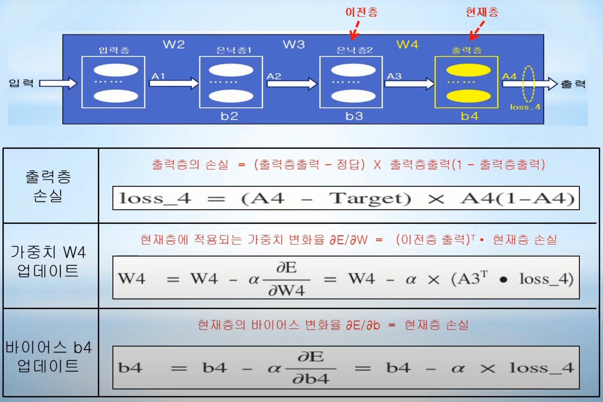

# Day05_오차역전파 


* *수치미분으로 가중치/ 바이어스를 업데이트 할 시 많은 시간이 소요된다.


- ### 오차역전파 (Back Propagation)

  - 가중치나 바이어스가 변할 때 최종오차가 얼마나 변하는지를 나타내는 델타E/델타W^(2) 같은 편미분을, 체인 룰을 이용하여 국소 미분으로 분리한 후에 이러한 국소 미분을 수학 공식으로 나타내서 계산하는 방법
  - 오차역전파는 수치미분을 사용하지 않고 행렬로 표현되는 수학공식을 계산하기 때문에 빠른 계산이 가능하다.
  - 시그모이드 함수 미분
  - 
  - 가중치 W^(2) / 가중치 W^(3) / 바이어스 b^(2) / 바이어스 b^(3) 미분 값을 수치미분이 아닌 행렬 기반의 수학공식을 이용하는 오차역전파를 구현해야 한다.

  

- ### 오차역전파 공식 유도

  - #### 출력층 공식 유도

    - 출력층 가중치 w^(3) 
    - 
    - 가중치 w11^(3)에대한 오차변화율
    - 
      - 위의 공식처럼 체인 룰을 이용하면 수치미분을 곱셈형식으로 바꿀 수 있다.
      - 나머지 w12^(3), w21^(3), w22^(3)도 위의 식으로 적용해주면 된다.

    - 출력층 바이어스 b^(3)

    - 

    - 최종 행렬 공식 

    - 
      - 수치미분의 공식이 행렬 기반의 공식으로 바뀐다
      - 미분이 아니라 행렬 기반이라 속도가 빠르다.

  - #### 은닉층 공식 유도

    - 은닉층 가중치 w^(2)
    - 

    - 가중치 w11^(2)에대한 오차변화율
    - 

    - 가중치 w12^(2)에대한 오차변화율
    - 
    - 은닉층 바이어스 b^(2)
    - 

    - 은닉층 가중치 최종 행렬 공식
    - 

    - 은닉층 바이어스 최종 행렬 공식
    - 


- ### 오차역전파 확장 공식 

  - 은닉층이 한개 이상인 신경망일 때 사용

  - 실무에서는 은닉층이 한개 이상인 신경망이 많이 쓰인다.

  - #### 공식 구하는 순서 (은닉층이 1개인 단순 신경망으로부터 공식 패턴 추출)

    1. 출력층의 출력 값과 정답(Target)을 이용하여, 출력층 손실을 계산한다.
       - 츨력층의 손실 = (출력층출력 - 정답) X 출력층출력(1 - 출력층출력)
    2. 은닉층에서의 (가상의)손실 loss_3, loss_2등을 계산할 경우, 현재 층 / 이전 층 / 다음 층 개념을 도입하여 동일한 패턴으로 반복 계산
       - ex) 은닉층2를 현재층으로 설정한다면, 이전층을 은닉층1 / 다음층을 출력층으로 가정한다.
       - 은닉층의 현재층 손실 = (다음층 손실 ㆍ 다음층에 적용되는 가중치 w^T) X 현재층출력(1 - 현재층출력)
    3. 계산된 각 층의 출력 값과 손실을 이용한다.
       - 현재층의 바이어스 변화율 δE/δb = 현재층 손실
       - 현재층에 적용되는 가중치 변화율 δE/δw = (이전층 출력)^T ㆍ 현재층 손실

  - #### 1개의 은닉층을 가진 신경망

    - 출력층(출력층 손실 / 가중치 변화율 / 바이어스 변화율)
    - 
    - 

    - 은닉층(은닉층 손실 / 가중치 변화율 / 바이어스 변화율)
    - 

  - #### 1개 이상의 은닉층을 가진 신경망

    - 출력층(출력층 손실 / 가중치 변화율 / 바이어스 변화율)
    - 

    - 은닉층(은닉층2 손실 / 가중치 변화율 / 바이어스 변화율)
    - 

  - #### 최종 오차역전파 일반 공식

    - 

    - 이러한 가중치의 변화율과 바이어스의 변화율 일반공식을 보면 일정한 패턴이 있다.
    - 이러한 패턴이 있기 때문에 신경망에서 아무리 많은 은닉층이 있어도 동일한 패턴을 이용하여 오차역전파 공식을 확장할 수 있다.


- ### 오차역전파 공식을 이용한 MNIST 인식

  - MNIST 전체 흐름
  - 
  
  - python 간략 코드 
  
    - external function
  
    - ``` python
      def sigmoid(x):	# 0 ~ 1 을 출력하기 위한 sigmoid 함수
          return 1 / (1 + np.exp(-x))
      ```
  
    - NeuralNetwork class
  
    - ``` python
      from datetime import datetime # datetime.now()를 이용하여 학습 경과 시간 측정
      
      class NeuralNetwork:
          # 가중치/바이어스/각 층 출력값/ 학습률 초기화
          def __init__(self, i_nodes, h_nodes, o_nodes, learning_rate) 
          def feed_forward(self) # feed forward를 이용하여 손실 함수 값 계산 
          def loss_val(self) # 손실 함수 값 계산 (외부 출력용)
          def train(self, input_data, target_data) # 오차역전파 공식을 이용하여 가중치/바이어스 업데이트
          def predict(self, input_data) # 입력 데이터에 대해 미래 값 예측
          def accuracy(self, test_data) # 신경망 기반의 딥러닝 아키텍처 정확도 측정
      ```
  
    - usage
  
    - ``` python
      nn = NeuralNetwork(784, 100, 10, 0.3)# 입력노드 784개, 은닉노드 100개, 출력노드 10개, 학습률 0.3 객체 생성
      
      for i in range(epochs): # epochs : 학습 반복 획수 
          for step in range(60000): # 60,000개의 training data를 이용하여 학습 진행
              input_data / target_data # one-hot encoding을 위한 데이터 정규화 작업 수행 
              nn.train(input_data, target_data) # training data를 이용하여 학습 진행
      ```
  
  - python 자세한 코드 
  
    - ``` python
      from datetime import datetime
      
      class NeuralNetwork:
          def __init__(self, i_nodes, h_nodes, o_nodes, learning_rate):
              self.i_nodes = i_nodes
              self.h_nodes = h_nodes
              self.o_nodes = o_nodes
              
              # 은닉층 가중치 W2 = (784 X 100) Xavier/He 방법으로 self.W2 가중치 초기화
              self.W2 = np.random.randn(self.i_nodes, self.h_nodes)/np.sqrt(self.i_nodes/2)
              self.b2 = np.random.rand(self.h_nodes)
              
              # 출력층 가중치 W3 = (100 X 10) Xavier/He 방법으로 self.W3 가중치 초기화
              self.W2 = np.random.randn(self.h_nodes, self.o_nodes)/np.sqrt(self.h_nodes/2)
              self.b2 = np.random.rand(self.o_nodes)
              
              # 출력층 선형회귀 값 Z3, 출력값 A3 정의 (모두 행렬로 표시)
              self.Z3 = np.zeros([1,o_nodes])
              self.A3 = np.zeros([1,o_nodes])
              
              # 은닉층 선형회귀 값 Z2, 출력값 A2 정의 (모두 행렬로 표시)
              self.Z2 = np.zeros([1,h_nodes])
              self.A2 = np.zeros([1,h_nodes])
              
              # 입력층 선형회귀 값 Z1, 출력값 A1 정의 (모두 행렬로 표시)
              self.Z1 = np.zeros([1,i_nodes])
              self.A1 = np.zeros([1,i_nodes])
              
              # 학습률 learning_rate 초기화
              self.learning_rate = learning_rate
              
          def feed_forward(self):
              delta = 1e-7 # log 무한대 발산 방지
              
              # 입력층 선형회귀 값 Z1, 출력값 A1 계산
              self.Z1 = self.i_data
              self.A1 = self.i_data
              
              # 은닉층 선형회귀 값 Z2, 출력값 A2 계산
              self.Z2 = np.dot(self.A1, self.W2) + self.b2
              self.A2 = sigmoid(self,Z2)
              
              # 출력층 선형회귀 값 Z3, 출력값 A3 계산
              self.Z3 = np.dot(self.A2, self.W3) + self.b3
              self.A3 = sigmoid(self,Z3)
              
              return -np.sum(self.target_data*np.log(self.A3+delta) + (1-self.target_data)*np.log((1-self.A3)+delta))
          
          # 위의 feed_foward와 코드 동일, 차이점 : feed는 신경망 내부에서 동작, 이 함수는 현재의 손실함수 값이 얼마인지 외부에 알려주는 함수 (사용자를 위한 함수)
          def loss_val(self): 
              delta = 1e-7 # log 무한대 발산 방지
              
              # 입력층 선형회귀 값 Z1, 출력값 A1 계산
              self.Z1 = self.i_data
              self.A1 = self.i_data
              
              # 은닉층 선형회귀 값 Z2, 출력값 A2 계산
              self.Z2 = np.dot(self.A1, self.W2) + self.b2
              self.A2 = sigmoid(self,Z2)
              
              # 출력층 선형회귀 값 Z3, 출력값 A3 계산
              self.Z3 = np.dot(self.A2, self.W3) + self.b3
              self.A3 = sigmoid(self,Z3)
              
              return -np.sum(self.target_data*np.log(self.A3+delta) + (1-self.target_data)*np.log((1-self.A3)+delta))
          
          def train(self, i_data, target_data):
              self.target_data = target_data
              self.i_data = i_data
              
              # 먼저 feed forward를 통해서 최종 출력값과 이를 바탕으로 현재의 에러 값 계산
              loss_val = self.feed_forward()
              
              # 출력층 loss인 loss_3 구함
              loss_3 = (self.A3-self.target_data) * self.A3 * (1-self.A3)
              
              # 출력층 가중치 W3, 출력층 바이어스 b3 업데이트
              self.W3 = self.W3 - self.learning_rate * np.dot(self.A2.T, loss_3)
              
              self.b3 = self.b3 - self.learning_rate * loss_3
              
              #은닉층 loss인 loss_2 구함
              loss_2 = np.dot(loss_3, self.W3.T) * self.A2 * (1-self.A2)
              
              # 은닉층 가중치 W2, 은닉층 바이어스 b2 업데이트
              self.W2 = self.W2 - self.learning_rate * np.dot(self.A1.T, loss_2)
              
              self.b2 = self.b2 - self.learning_rate * loss_2
              
          def predict(self, i_data): # i_data는 행렬로 입력됨. 즉, (1, 784) shape을 가짐
              Z2 = np.dot(i_data, self.W2) + self.b2
              A2 = sigmoid(Z2)
              
              Z3 = np.dot(A2, self.W3) + self.b3
              A3 = sigmoid(Z3)
              
              predicted_num = np.argmax(A3)
              
              return predicted_num
              
          def accuracy(self, test_data): 
              matched_list = []
              not_matched_list = []
              
              for index in range(len(test_data)):
                  label = int(test_data[index, 0]) # test_data의 1열에 있는 정답 분리
                  
                  # one-hot encoding을 위한 데이터 정규화 (data normalize)
                  # 입력 데이터는 0~255이기 때문에, 가끔 overflow 발생.
                  # 따라서 784개의 모든 입력 값을 0~1 사이의 값으로 nomalize 함
                 	data = (test_data[index, 1:] / 255.0 * 0.99) + 0.01
                  
                  # predict를 위해서 vector를 martrix로 변환하여 인수로 넘겨줌
                  predicted_num = self.predict(np.array(data, ndmin=2))
                  
                  if label == predicted_num:
                      matched_list.append(index) # 정답과 예측 값이 맞으면 matched_list에 추가
                  else:
                      not_matched_list.append(index) # 정답과 예측 값이 틀리면 not_matched_list에 추가
              # 정확도 계산 (정답데이터/전체 테스트데이터)        
             	print("Current Accuracy = ", 100*(len(matched_list)/(len(test_data))), " %")
              
              retrun matched_list, not_matched_list
      ```
  
    - 5만번의 학습을 하는데 걸리는 시간이 26초 정도 걸린다.
  
    - 이전의 수치미분으로 했던 것보다 훨씬 빠르다.
