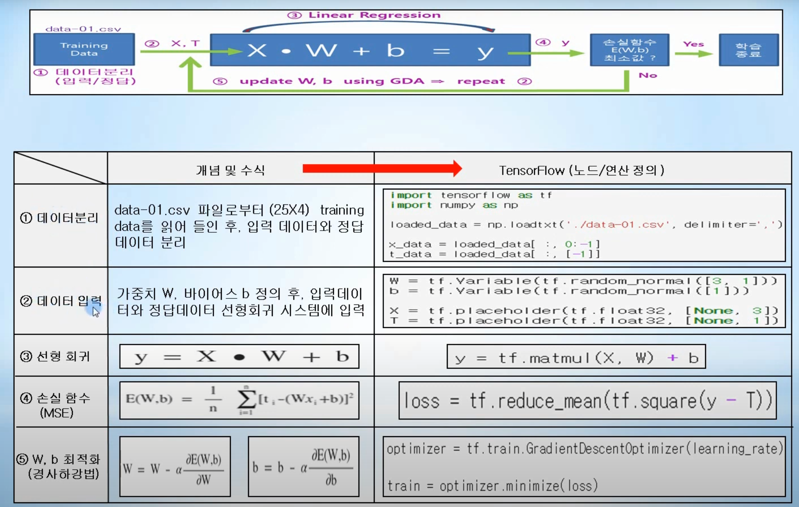
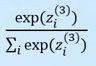

# Day06_Tensorflow


- ### 텐서플로우

  - Google에서 개발하고 공개한 머신러닝/딥러닝 라이브러리
    - C++, Java등의 다양한 언어를 지원하지만 파이썬에 최적화 되어있다.
    - 이름이 나타내고 있는 것처럼 텐서(Tensor)를 흘려보내면서 머신러닝과 딥러닝 알고리즘을 수행하는 라이브러리
  - 윈도우 환경에서 Tensorflow 설치
    - 아나콘다 배포판으로 파이썬 설치하고, 파이썬 pip를 이용하여 Tensorflow 설치
      - `pip install tensorflow`
    - 아나콘다 배포판 다운로드 : https://www.anaconda.com/distribution
    - Tensorflow 설치 시 error가 나는 경우에는, `pip install --upgrade pip` 명령으로 pip 버전을 업그레이드 한 후 재차 Tensorflow를 설치한다.


- ### 텐서 (Tensor)

  - 취급하는 모든 데이터를 의미 
    - 숫자 1 (스칼라 또는 rank 0 텐서)
    - 1차원 배열 [1,2] (벡터 또는 rank 1 텐서)
    - 2차원 배열 [[1,2], [3,4]] (행렬 또는 rank 2 텐서)
    - 3차원 배열 [[[1,2]], [[3,4]]] (텐서 또는 rank 3 텐서)
  - 그래프 구조에서 노드에서 노드로 흘러간다.
  - 그래프 자료구조는 노드와 엣지(Edge)로 구성되어 있다.
  - 텐서플로우를 이용한 프로그램 작성 시
    1. 상수, 변수, 텐서연산 등의 노드와 엣지를 먼저 정의 한다.
    2. 세션을 만들고 그 세션을 통해 노드간의 데이터(텐서) 연산을 수행한다.

  

- ### 상수 노드

  1. 상수 값을 저장하는 노드를 만들기 위해 상수노드 tf.constant()를 정의한다.
  2. 세션을 만들지 않고 print와 같은 명령문을 실행하면, 저장된 값이 아닌 현재 정의되어 있는 노드의 상태(노드타입, shape 등)가 출력된다.
  3. 노드간의 연산을 위해 세션을 생성한다.
  4. 세션을 통해 (sess.run()) 노드에 값이 할당되고 노드간의 텐서를 흘려보내면서 연산과 명령문 등이 실행된다.
  5. 생성된 세션을 close 해준다.

  - ``` python
    import tensorflow as tf
    
    # 상수 노드 정의
    a = tf.constant(1.0, name='a') # 시각화 툴인 텐서보드에서 name 지정
    b = tf.constant(2.0, name='b')
    c = tf.constant([[1.0, 2.0], [3.0, 4.0]])
    
    print(a)
    print(a+b)
    print(c)
    
    # 세션 (session)을 만들고 노드간의 텐서 연산 실행
    sess = tf.Session()
    
    print(sess.run([a,b]))
    print(sess.run(c))
    print(sess.run([a+b]))
    print(sess.run(c+1.0)) # broadcast 수행
    
    # 세션 close
    sess.close()
    ```


- ### 플레이스 홀더 노드 

  1. 텐서플로우에서는 임의의 값을 입력으로 받기 위해 플레이스홀더 노드(tf.placeholder())를 정의한다.
  2. 노드간의 연산을 위해 세션을 생성한다.
  3. 플레이스홀더 노드에 실제 값을 넣어줄때는 sess.run 첫번째 인자로 실행하고자 하는 연산을 넣어주고, 두번째 인자에는 실제로 넣을 값들을 Dictionary형태로 넣어주는 feed_dict를 선언하고, feed_dict부분에 플레이스홀더에 넣을 값을 지정해 준다.
  4. 생성된 세션을 close 해준다.

  - ```python
    import tensorflow as tf
    
    # 플레이스홀더 노드 정의
    a = tf.placeholder(tf.float32)
    b = tf.placeholder(tf.float32)
    c = a + b
    
    # 세션(session)을 만들고 플레이스홀더 노드를 통해 값을 입력받음
    sess = tf.Session()
    
    print(sess.run(c, feed_dict={a:1.0, b:3.0}))
    print(sess.run(c, feed_dict={a:[1.0, 2.0], b:[3.0, 4.0]}))
    
    # 연산 추가
    d = 100 * c
    
    print(sess.run(d, feed_dict={a:1.0, b:3.0}))
    print(sess.run(d, feed_dict={a:[1.0, 2.0], b:[3.0, 4.0]}))
    
    # 세션 close
    sess.close()
    ```


- ### 변수 노드

  1. 가중치나 바이어스처럼 계속 업데이트 되는 변수는 텐서플로우에서 변수 노드(tf.Variable)로 정의한다.
     - tf.Variable()에서 사용되는 초기값
       - tf.random_normal, tf.truncated_normal, tf.random_uniform, tf.ones, tf.zeros, tf.constant등이 있다.
  2. 노드간의 연산을 위해 세션을 생성한다.
  3. 변수노드 값 초기화를 위해서 반드시 tf.global_variables_initializer()를 실행한다.
  4. 변수노드 값을 업데이트한다.
  5. 생성된 세션을 close 해준다.

  - ``` python
    import tensorflow as tf
    
    # 값이 계속 업데이트되는 변수노드 정의
    W1 = tf.Variable(tf.random_normal([1])) # W1 = np.random.rand(1)과 비슷하다.
    b1 = tf.Variable(tf.random_normal([1])) # b1 = np.random.rand(1)과 비슷하다.
    
    W2 = tf.Variable(tf.random_normal([1,2])) # W2 = np.random.rand(1,2)과 비슷하다.
    b2 = tf.Variable(tf.random_normal([1,2])) # b2 = np.random.rand(1,2)과 비슷하다.
    
    # 세션 생성
    sess = tf.Session()
    
    # 변수노드 값 초기화. 변수노드를 정의했다면 반드시 필요함
    sess.run(tf.global_variables_initializer())
    
    for step in range(3):
        W1 = W1 - step # W1 변수노드 업데이트
        b1 = b1 - step # b1 변수노드 업데이트
        
        W2 = W2 - step # W2 변수노드 업데이트
        b2 = b2 - step # b2 변수노드 업데이트
        
        print("step = ", step, ", W1 = ", sess.run(W1), ", b1 = ", sess.run(b1))
        print("step = ", step, ", W2 = ", sess.run(W2), ", b2 = ", sess.run(b2))
    
    # 세션 close
    sess.close()
    ```

  - 딥러닝에서 계속해서 값이 업데이트 되는 가중치와 바이어스 같은 것들은 텐서플로우에서 이런 변수노드로 정의해주고  실제 실행은 세션을 통해서 세션run으로 계속 지속적으로 업데이트된다는 것을 알 수 있다.


- ### 텐서플로우를 이용한 linear Regression (multi-variable example)

  - 노드 / 연산 정의 개요
  - 

  - 노드 / 연산 구현

    1. np.loadtxt()를 이용하여 data-01.csv 파일로부터 25X4 데이터를 읽어 들인 후, 슬라이스 기능을 이용하여 모든 행에 대해 1열~3열까지는 입력데이터(x_data)로 분리하고, 마지막 열인 4열 데이터는 정답 데이터(t_data)로 분리한다.
    2. 가중치 노드 W, 바이어스 노드 b를 정의하고, feed_dict를 통해 데이터를 넣어주기 위해서 입력데이터 노드와 정답데이터 노드를 정의한다.
    3. 현재의 X, W, b를 바탕으로 선형회귀 값 y를 계산하고, y와 정답 T를 이용하여 손실함수를 정의한다.
    4. 가중치 W, 바이어스 b를 최적화 하기 위해서 경사하강법을 적용한 optimizer를 정의한다.
       (이처럼 Tensorflow는 다양한 optimizer를 이용하여 손실함수를 최소화 하고, 최종적으로 W, b를 최적화 시킨다.)

  - ```python
    import tensorflow as tf
    import numpy as np
    
    loaded_data = np.loadtxt('./data-01.csv', delimiter=',')
    
    x_data = loaded_data[ :, 0:-1]
    t_data = loaded_data[ :, [-1]]
    
    print("x_data.shape = ", x_data.shape)
    print("t_data.shape = ", t_data.shape)
    
    W = tf.Variable(tf.random_normal([3, 1]))
    b = tf.Variable(tf.random_normal([1]))
    
    # 현재 25X3이지만, 25X3이 아닌 None을 지정하면 차후 50X3, 125X3등으로 확장이 가능하다.
    X = tf.placeholder(tf.float32, [None, 3]) 
    T = tf.placeholder(tf.float32, [None, 1])
    
    y = tf.matmul(X, W) + b # 현재 X, W, b를 바탕으로 계산된 값
    loss = tf.reduce_mean(tf.square(y - T)) # MSE 손실함수 정의
    
    learning_rate = 1e-5 # 학습율
    
    optimizer = tf.train.GradientDescentOptimizer(learning_rate) # 경사하강법 알고리즘이 적용되는 optimizer
    
    train = optimizer.minimize(loss) # optimizer를 통한 손실함수 최소화
    ```

  - 노드 / 연산 실행

  - ```python
    with tf.Session() as sess:
        sess.run(tf.global_variables_initializer()) # 변수 노드(tf.Variable) 초기화
        for step in range(8001):
            # train은 optimizer를 실행한 결과인데 특별히 저장할 이유는 없지만 
            # notation을 맞추기위해 anonymous인 언더바로 표시
            loss_val, y_val, _ = sess.run([loss, y, train], feed_dict={X: x_data, T: t_data})
            
            if step % 400 == 0:
                print("step = ", step, ", loss_val = ", loss_val)
                
        print("\nPrediction is ", sess.run(y, feed_dict={X: [[100, 98, 81]]}))
    ```

  - Python만으로 구현한 결과값과 텐서플로우로 구현한 결과값이 거의 일치하는 것을 볼 수 있다.


- ### 텐서플로우를 이용한 Logistic Regression (diabetes(당뇨병) example)

  - 노드 / 연산 정의

    1. np.loadtxt() 이용하여 diabetes.csv 파일로부터 759 X 9 데이터를 읽어 들인 후, 슬라이스 기능을 이용하여 모든 행에 대해 1열 ~ 8열까지는 입력데이터로 분리하고, 마지막 열인 9열 데이터는 정답데이터로 분리한다.
    2. 세션을 통해 feed_dict으로 데이터를 넣어주기 위해서 입력데이터 노드 X, 정답데이터 노드 T를 정의한다. 
    3. 입력데이터가 8개이므로 가중치 노드 W는 행렬곱을 위해 8 X 1로 정의하고, 바이어스 노드 b는 1개로 정의한다.
    4. 현재의 X, W, b를 바탕으로 선형회귀 값 z 와 sigmoid 값 y 계산 후에, y와 정답 T를 이용하여 손실함수 loss를 Cross-Entroy 정의한다.
    5. 가중치 W, 바이어스 b를 최적화 하기 위해서 경사하강법을 적용한 optimizer를 정의한다.
    6. 이처럼 Tensorflow에서 경사하강법이 적용된 optimizer(GradientDescentOptimizer)는 내부적으로 오차역전파 등을 이용하여 미분을 수행하면서 손실함수 loss를 최소화 하고, 최종적으로는 W, b를 최적화 시킨다.
    7. 손실함수가 최소값을 가지면, 학습을 종료하고 학습이 얼마나 정확하게 이루어 졌는지, 정확도(accuracy)를 측정해야 한다.

  - ``` python
    import tensorflow as tf
    import numpy as np
    
    loaded_data = np.loadtxt('./diabetes.csv', delimiter=',')
    
    x_data = loaded_data[ :, 0:-1]
    t_data = loaded_data[ :, [-1]]
    
    print("loaded_data = ", loaded_data.shape)
    print("x_data = ", x_data.shape, ", t_data = ", t_data.shape)
    
    X = tf.placeholder(tf.float32, [None, 8]) 
    T = tf.placeholder(tf.float32, [None, 1])
    
    W = tf.Variable(tf.random_normal([8, 1]))
    b = tf.Variable(tf.random_normal([1]))
    
    z = tf.matmul(X,W) + b # 선형회귀 값 z
    
    y = tf.sigmoid(z) # 시그모이드로 계산한 값
    
    # 손실함수는 Cross-Entropy
    loss = -tf.reduce_mean(T*tf.log(y) + (1-T)*tf.log(1-y))
    
    learning_rate = 0.01 # 학습율
    
    optimizer = tf.train.GradientDescentOptimizer(learning_rate)
    
    train = optimizer.minimize(loss)
    
    predicted = tf.cast(y > 0.5, dtype=tf.float32)
    
    # 데이터의 평균 계산
    accuracy = tf.reduce_mean(tf.cast(tf.equal(predicted, T), dtype=tf.float32))
    ```

  - 노드 / 연산 실행

  - ```python
    with tf.Session() as sess:
        sess.run(tf.global_variables_initializer()) # 변수 노드(tf.Variable) 초기화
        
        for step in range(20001):
            
            loss_val, _ = sess.run([loss, train], feed_dict={X: x_data, T: t_data})
            
            if step % 500 == 0:
                print("step = ", step, ", loss_val = ", loss_val)
        
        # Accuracy 확인
        y_val, predicted_val, accuracy_val = sess.run([y, predicted, accuracy], feed_dict={X: x_data, T: t_data})
        
        print("\ny_val.shape = ", y_val.shape, ", predicted_val = ", predicted_val.shape)
        print("\nAccuracy = ", accuracy_val)
    ```

  - 하이퍼 파라미터 조정, 가중치 초기화 방법 변경 또는 아키텍처 변경 등을 통해 정확도를 높여 볼 수 있다.


- ### 텐서플로우를 이용한 Neural Network (MNIST example)

  - 텐서플로우에서는 sigmoid 함수 대신 은닉층에서는 relu()함수를 쓰고 출력층에서는 softmax()(확률분포)함수를 사용한다.
  
  - 은닉층 relu
  
    - sigmoid 출력값은 0 ~ 1 사이의 값을 출력해주는 반면에 relu 출력값은 입력값이 0보다 작은 값은 0으로 출력해주고 입력값이 0보다 큰 값은 그 값 그대로 출력해준다는 특징이 있다.
    - relu를 많이 쓰는 이유는 경사도가 사라지는 문제를 완화시킬 수 있기 때문이다.
  
  - 출력층 softmax
  
    - softmax 출력값은  확률분포식을 가지고 있다.
    - 분모의 선형회귀값을 모두 더한 값에대해서 각 선형회귀값이 얼마나 차지하고 있는지 확률을 나타낸다.
    - softmax 함수의 출력은 0과 1사이 값이며 모두 더하면 1이 된다.
    - 출력 총합이 1이라는 것은 각각의 값이 정답일 확률을 나타낸다고 해석할 수 있다.
  
  - 노드 / 연산 정의
  
    1. read_data_sets()를 통해 객체형태인 mnist로 받아오고 입력데이터와 정답데이터는 MNIST_data/ 디렉토리에 저장이 되는데, one_hot=True 옵션을 통해 정답데이터는 one-hot encoding 형태로 저장된다.
       (mnist 객체는 train, test, validation 3개의 데이터 셋으로 구성되어 있으며, num_examples 값을 통해 데이터의 개수 확인이 가능하다. 데이터는 784(28X28)개의 픽셀을 가지는 이미지와 one-hot encoding 되어 있는 label을 가지고 있다.)
    2. 입력노드 784개, 은닉노드 100개, 출력노드 10개, 학습율, 반복횟수, 한번에 입력으로 주어지는 데이터 개수인 배치 사이즈 등을 설정한다.
    3. 입력과 출력을 위한 placeholder 노드와 가중치, 바이어스를 위한 Variable 노드를 정의한다.
    4. feed foward 수행. 은닉층 출력 값 A2는 sigmoid가 아닌 relu를 사용하며, 출력층에서의 선형회귀 값(logits) Z3를 softmax 함수의 입력으로 넣어주어 출력층의 출력 값 (y=A3)을 계산한다.
    5. 출력층 선형회귀 값(logits) Z3와 정답 T를 이용하여 손실 함수 loss를 정의한다.
       (tf.nn.softmax_cross_entropy_with_logits_v2()에 의해 100개의 데이터에 대해 각각의 소프트맥스가 계산된 후 정답과의 비교를 통해 크로스 엔트로피 손실 함수 값이 계산되고, tf.reduce_mean()에 의해서 100개의 손실함수 값의 평균이 계산된다.)
    6. one-hot encoding에 의해서 출력 층 계산 값 A3와 정답 T는 (batch_size X 10) shape을 가지는 행렬이다. 따라서 argmax의 두번째 인자에 1을 주어 행 단위로 A3와 T를 비교한다.
  
  - ``` python
    import tensorflow as tf
    from tensorflow.examples.tutorials.mnist import input_data
    import numpy as np
    
    mnist = input_data.read_data_sets("MNIST_data/", one_hot=True)
    
    print("\n", mnist.train.num_examples, mnist.test.num_examples,mnist.validation.num_examples)
    
    print("\ntrain image shape = ", np.shape(mnist.train.images))
    print("train label shape = ", np.shape(mnist.train.labels))
    print("test image shape = ", np.shape(mnist.test.images))
    print("test label shape = ", np.shape(mnist.test.labels))
    
    learning_rate = 0.1 # 학습율
    epochs = 100 # 반복횟수
    batch_size = 100 # 한번에 입력으로 주어지는 MNIST 개수
    
    input_nodes = 784 # 입력노드 개수
    hidden_nodes = 100 # 은닉노드 개수
    output_nodes = 10 # 출력노드 개수
    
    X = tf.placeholder(tf.float32, [None, input_nodes]) 
    T = tf.placeholder(tf.float32, [None, output_nodes])
    
    W2 = tf.Variable(tf.random_normal([input_nodes, hidden_nodes])) # 은닉층 가중치 노드
    b2 = tf.Variable(tf.random_normal([hidden_nodes])) # 은닉층 바이어스 노드
    
    W3 = tf.Variable(tf.random_normal([hidden_nodes, output_nodes])) # 출력층 가중치 노드
    b3 = tf.Variable(tf.random_normal([output_nodes])) # 출력층 바이어스 노드
    
    z = tf.matmul(X,W2) + b2 # 선형회귀 값 z2
    A2 = tf.nn.relu(Z2) # 은닉층 출력 값 A2, sigmoid 대신 relu 사용
    
    # 출력층 선형회귀 값 Z3, 즉 softmax에 들어가는 입력 값
    Z3 = logits = tf.matmul(A2, W3) + b3
    y = A3 = tf.nn.softmax(Z3)
    
    # 출력층 선형회귀 값(logits) Z3와 정답 T를 이용하여 손실함수 크로스 엔트로피를 계산
    loss = tf.reduce_mean(tf.nn.softmax_cross_entropy_with_logits_v2(logits=Z3, labels=T))
    
    optimizer = tf.train.GradientDescentOptimizer(learning_rate)
    
    train = optimaizer.minimize(loss)
    
    # batch_size X 10 데이터에 대해 argmax를 통해 행단위로 비교한다.
    predicted_val = tf.equal(tf.argmax(A3, 1), tf.argmax(T, 1))
    
    # batch_size X 10의 True, False를 1 또는 0으로 변환
    accuracy = tf.reduce_mean(tf.cast(predicted_val, dtype=tf.float32))
    ```
  
  - 노드 / 연산 실행
  
  - ```python
    with tf.Session() as sess:
        sess.run(tf.global_variables_initializer()) # 변수 노드(tf.Variable) 초기화
        
        for step in range(epochs):
            
            total_batch = int(mnist.train.num_examples / batch_size) # 55,000 / 100
            
            for step in range(total_batch):
                batch_x_data, batch_t_data = mnist.train.next_batch(batch_size)
                loss_val, _ = sess.run([loss, train], feed_dict={X: batch_x_data, T: batch_t_data})
                if step % 100 == 0:
                    print("step = ", step, ", loss_val = ", loss_val)
        
        # Accuracy 확인
        test_x_data = mnist.test.images # 10000 X 784
        test_t_data = mnist.test.labels # 10000 X 10
        
        accuracy_val = sess.run(accuracy, feed_dict={X: test_x_data, T: test_t_data})
        
        print("\nAccuracy = ", accuracy_val)
    ```
  
  - MNIST와 같은 이미지데이터에 대한 인식정확도를 99% 이상으로 높이기 위해서는 신경망 아키텍처를 CNN(Convolutional Neural Network)으로 전환하는 것이 필요하다.

