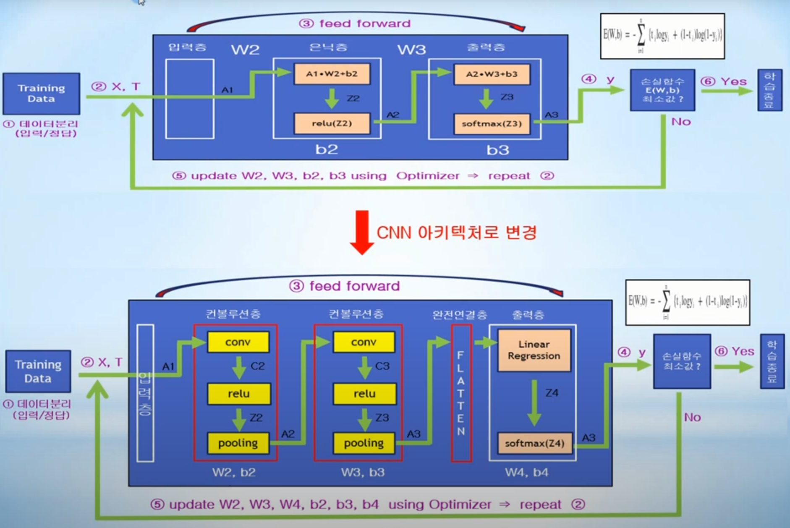
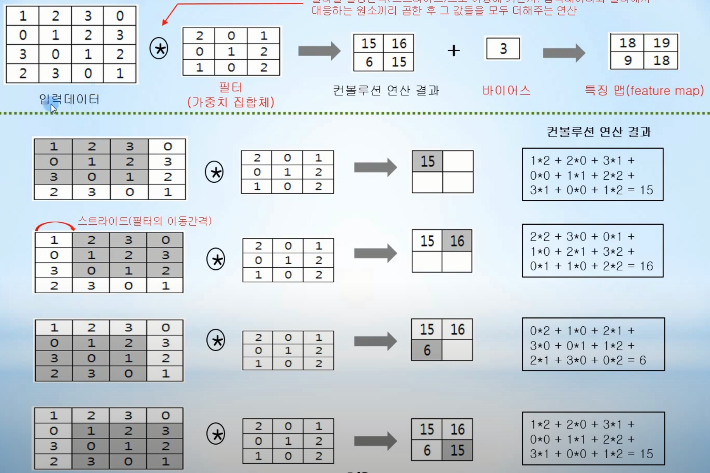
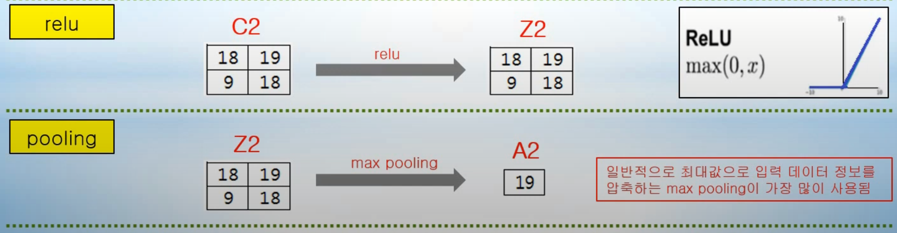
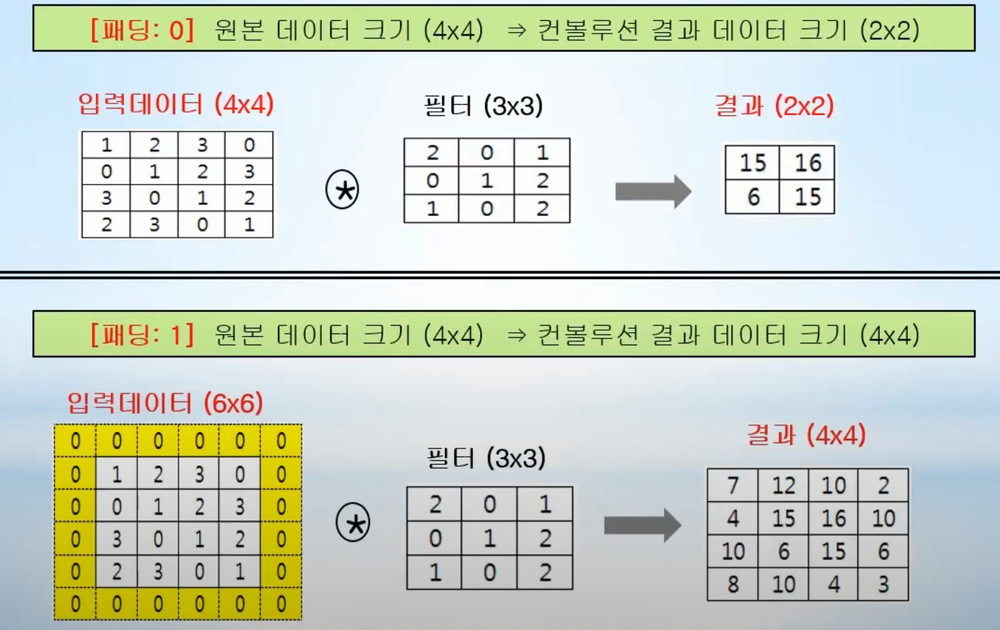
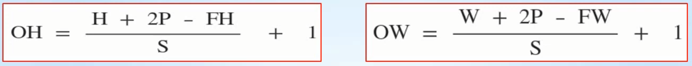
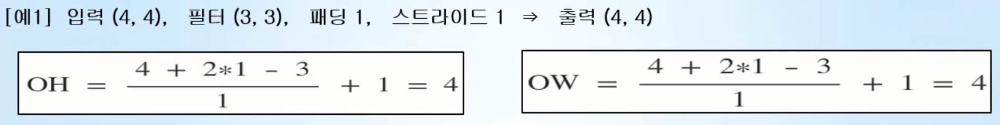
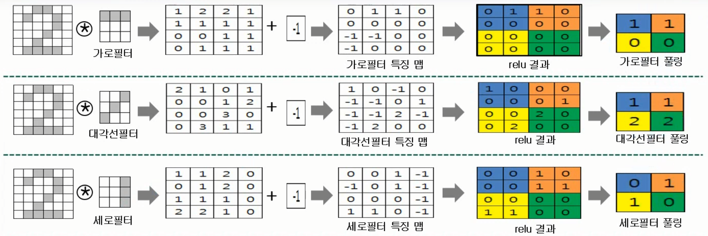
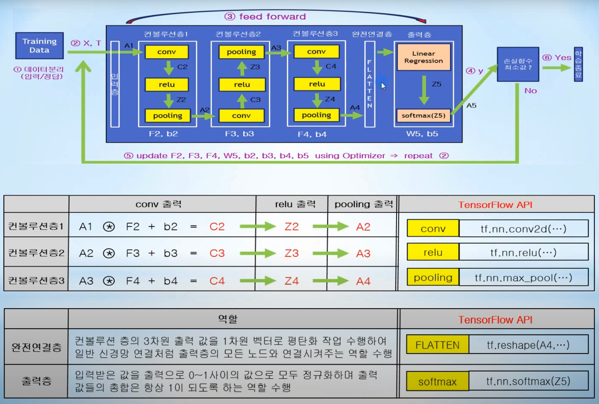

# Day07_CNN


- ### CNN (Convolutional Neural Network 합성곱 신경망)

  - 컨볼루션을 사용하는 딥러닝
  - 아키텍처 비교
  - 


- ### 컨볼루션층 개요

  - #### 컨볼루션 층 역할 

    - 입력데이터와 가중치들의 집합체인 1개 이상의 필터들과의 컨볼루션 연산을 통해 입력데이터의 특징을 추출하여 특징 맵을 만들고, 특징 맵에서 최대 값을 뽑아내서 다음 층으로 전달하는 역할이다.

  - #### conv (컨볼루션, convolution)

    - 입력데이터와 가중치들의 집합체인 다양한 필터와의 컨볼루션 연산을 통해 입력데이터의 특징을 추출하는 역할을 수행한다.
    - A1 * filter_1 + b2 -> 입력데이터 A1 특징(feature) 추출
    - A2 * filter_2 + b3 -> 입력데이터 A2 특징(feature) 추출
  
  - #### pooling (풀링)
  
    - 입력 정보를 최대값, 최소값, 평균값 등으로 압축하여 데이터 연산량을 줄여주는 역할을 수행한다.


- ### 컨볼루션 연산 - 특징 추출 (특징 맵, feature map)

  - 필터를 일정간격(스트라이드)으로 이동해 가면서, 입력데이터와 필터에서 대응하는 원소끼리 곱한 후 
    그 값들을 모두 더해주는 연산
  - 


- ### relu 연산 / pooling 연산

  - 


- ### 패딩  (padding)

  - 컨볼루션 연산을 수행하기 전에 입력 데이터 주변을 특정 값(예를 들면 0)으로 채우는 것을 말하며, 컨볼루션 연산에서 자주 이용되는 방법
  - 컨볼루션 연산을 수행하면 데이터 크기(shape)이 줄어드는 단점을 방지하기 위해 사용 
  - 


- ### 컨볼루션 연산을 통한 출력 데이터 크기(shape) 계산

  - 입력 데이터 크기 (H, W), 필터 크기 (FH, FW), 패딩 P, 스트라이드 S 일 때 출력 데이터 크기 (OH, OW)
  - 

  - 


- ### 필터를 통한 입력 데이터 특징 추출 원리 - 특징 맵이 압축된 풀링 값

  - 

  - 컨볼루션 연산 결과인 특징 맵(feature map) 값을 압축하고 있는 풀링 값을 보면, 대각선 필터에 대한 풀링 값이 가로와 세로 필터의 풀링 값 보다 큰 값으로 구성되어 있다.
  - 풀링 값이 크다는 것은, 데이터 안에 해당 필터의 특징이 많이 포함되어 있다는 것을 의미한다.
    (즉, 특징 맵 값이 압축되어 있는 풀링 결과 값을 통해 데이터의 특징(성분)을 추출 할 수 있다.)
  - 위의 예제를 보면,  입력 데이터 '2'는 대각선 특징이 가로나 세로 특징보다 더욱 많이 포함되어 있으며 이러한 특징을 추출하는데 대각선 필터가 가로나 세로보다 유용하다는 것을 알 수 있다.


- ### CNN 코드

  - CNN(컨볼루션 신경망) 아키텍처
  
  - 
  
  - #### conv (tf.nn.conv2d(input, filter, strides, padding, ...))
  
    - input : 컨볼루션 연산을 위한 입력 데이터이며 [batch, in_height, in_width, in_channels] 
      ( ex) 100개의 배치로 묶은 28X28 크기의 흑백 이미지를 입력으로 넣을 경우 input은 [100,28, 28, 1]로 나타낸다.)
    - filter : 컨볼루션 연산에 적용할 필터이며 [filter_height, filter_width, in_channels, out_channels]
      ( ex) 필터 크기 3X3이며 입력채널 개수는 1이고 적용되는 필터 개수가 총 32개이면 filter는 [3, 3, 1, 32]로 나타낸다.)
      - 입력채널 : 직관적으로 데이터가 들어오는 통로라고 생각하면 된다. 즉, 입력채널이 1이면 데이터가 들어오는 통로가 1개이며, 입력채널이 32라고 하면 32개의 통로를 통해서 입력데이터가 들어온다고 판단하면 된다.
    - strides : 컨볼루션 연산을 위해 필터를 이동시키는 간격을 나타낸다.
      ( ex) [1, 1, 1, 1]로 strides를 나타낸다면 컨볼루션 적용을 위해 1칸씩 이동 필터를 이동하는 것을 의미한다.)
    - padding : 'SAME' 또는 'VALID ' 값을 가진다. padding = 'VALID'라면 컨볼루션 연산 공식에 의해서 가로/세로 크기가 축소된 결과가 리턴된다. padding='SAME'으로 지정하면 입력 값의 가로/세로 크기와 같은 출력이 리턴되도록 작아진 차원 부분에 0 값을 채운 제로패딩을 수행한다.
  
  - #### pooling (tf.nn.max_pool(value, ksize, strides, padding, ...))
  
    - value : [batch, height, width, channels] 형식의 입력데이터, 일반적으로 relu를 통과한 출력결과를 말하며,  위 아키텍처에서는 Z2, Z3,Z4 등의 값이 value이다.
    - ksize : 컨볼루션 신경망에서 일반적인 ksize는 다음과 같이 [1, height, width, 1] 형태로 표시한다. 
      - ex) ksize = [1, 2, 2, 1]이라면 2칸씩 이동하면서 출력결과 1개를 만들어 낸다는 것을 의미한다. 즉, 4개 (2X2) 데이터 중에서 가장 큰 값 1개를 찾아서 반환하는 역할을 수행한다. 만약 ksize =[1, 3, 3, 1]이라고 하면 3칸씩 이동, 즉 9개 (3X3) 데이터 중에서 가장 큰 값을 찾는다는 의미이다.
    - strides : max pooling을 위해 윈도우를 이동시키는 간격을 나타낸다.
      - ex) [1, 2, 2, 1]로 strides를 나타낸다면 max pooling 적용을 위해 2칸씩 이동하는 것을 의미한다.
    - padding : max pooling에서의 padding 값은 max pooling을 수행하기에는 데이터가 부족한 경우에 주변을 0등으로 채워주는 역할을 한다.
  
  - ### 노드 / 연산 정의
  
    1. read_data_sets()를 통해 격체형태인 mnist로 받아오고 입력데이터와 정답데이터는 MNIST_data/ 디렉토리에 저장이 되는데, one_hot=True 옵션을 통해 정답데이터는 one-hot encoding 형태로 저장된다.
    2. 학습율, 반복횟수, 한번에 입력으로 주어지는 데이터 개수인 배치 사이즈등의 하이퍼 파라미터를 설정한다.
    3. 입력과 정답을 위한 placeholder 노드 정의(X, T)
       입력층의 출력 값 A1은 784개 픽셀 값을 가지고 있는 MNIST 데이터이지만 컨볼루션 연산을 수행하기 위해서 28X28X1 차원을 가지도록 reshape 한다.
    4. 출력층 선형회귀 값(logits) Z5와 정답 T를 이용하여 손실 함수 loss를 정의한다.
    5. one-hot encoding에 의해서 출력 층 계산 값 A5와 정답 T는 (batch_size X10) shape을 가지는 행렬이다.
  
  - ``` python
    import tensorflow as tf
    from tensorflow.examples.tutorials.mnist import input_data
    import numpy as np
    from datetime import datetime # datetime.now()를 이용하여 학습 경과 시간 측정
    
    mnist = input_data.read_data_sets("MNIST_data/", one_hot=True)
    
    print("\n", mnist.train.num_examples, mnist.test.num_examples, mnist.validation.num_examples)
    
    print("/ntrain image shape = ", np.shape(mnist.train.images))
    print("train label shape = ", np.shape(mnist.train.labels))
    print("test image shape = ", np.shape(mnist.test.images))
    print("test label shape = ", np.shape(mnist.test.labels))
    
    # Hyper-Parameter 
    learning_rate = 0.001 # 학습율
    epochs = 30 # 반복횟수
    batch_size = 100 # 한번에 입력으로 주어지는 MNIST 개수
    
    # 입력과 정답을 위한 플레이스홀더 정의
    X = tf.placeholder(tf.float32, [None, 784])
    
    T = tf.placeholder(tf.float32, [None, 10])
    
    # 입력층의 출력 값, 컨볼루션 연산을 위해 reshape 시킨다.
    A1 = X_img = tf.reshape(X, [-1, 28, 28, 1]) # image 28 X 28 X 1(black/white)
    
    # 출력층 선형회귀 값 Z5와 정답 T를 이용하여 손실함수 크로스 엔트로피를 계산한다.
    loss = tf.reduce_mean(tf.nn.softmax_cross_entropy_with_logits_v2(logits=Z5, labels=T))
    
    # 성능개선을 위해 AdamOptimizer 사용
    optimizer = tf.train.AdamOptimizer(learning_rate)
    
    train = optimizer.minimize(loss)
    
    # batch_size X 10 데이터에 대해 argmax를 통해 행단위로 비교한다.
    predicted_val = tf.equal(tf.argmax(A5, 1), tf.argmax(T, 1))
    
    # batch_size X 10의 True, False를 1 또는 0으로 변환
    accuracy = tf.reduce_mean(tf.cast(predicted_val, dtype=tf.float32))
    
    ```
  
  - #### 컨볼루션층1
  
  - ``` python
    # 1번째 컨볼루션 층
    # 3X3 크기를 가지는 32개의 필터를 적용
    F2 = tf.Variable(tf.random_normal([3, 3, 1, 32], stddev = 0.01))
    b2 = tf.Variable(tf.constant(0.1, shape=[32]))
    
    # 1번째 컨볼루션 연산을 통해 28 X 28 X 1 => 28 X 28 X 32
    C2 = tf.nn.conv2d(A1, F2, strides=[1, 1, 1, 1], padding='SAME')
    
    # relu
    Z2 = tf.nn.relu(C2+b2)
    
    # 1번째 max pooling을 통해 28 X 28 X 32 => 14 X 14 X 32
    A2 = P2 =tf.nn.max_pool(Z2, ksize=[1, 2, 2, 1], strides=[1, 2, 2, 1], padding = 'SAME')
    ```
  
  - #### 컨볼루션층2
  
  - ```python
    # 2번째 컨볼루션 층
    # 3X3 크기를 가지는 64개의 필터를 적용
    F3 = tf.Variable(tf.random_normal([3, 3, 32, 64], stddev = 0.01))
    b3 = tf.Variable(tf.constant(0.1, shape=[64]))
    
    # 2번째 컨볼루션 연산을 통해 14 X 14 X 32 => 14 X 14 X 64
    C3 = tf.nn.conv2d(A2, F3, strides=[1, 1, 1, 1], padding='SAME')
    
    # relu
    Z3 = tf.nn.relu(C3+b3)
    
    # 2번째 max pooling을 통해 14 X 14 X 64 => 7 X 7 X 64
    A3 = P3 =tf.nn.max_pool(Z3, ksize=[1, 2, 2, 1], strides=[1, 2, 2, 1], padding = 'SAME')
    ```
  
  - #### 컨볼루션층3
  
  - ```python
    # 3번째 컨볼루션 층
    # 3X3 크기를 가지는 128개의 필터를 적용
    F4 = tf.Variable(tf.random_normal([3, 3, 64, 128], stddev = 0.01))
    b4 = tf.Variable(tf.constant(0.1, shape=[128]))
    
    # 3번째 컨볼루션 연산을 통해 7 X 7 X 64 => 7 X 7 X 128
    C4 = tf.nn.conv2d(A3, F4, strides=[1, 1, 1, 1], padding='SAME')
    
    # relu
    Z4 = tf.nn.relu(C4+b4)
    
    # 3번째 max pooling을 통해 7 X 7 X 128 => 4 X 4 X 128
    A4 = P4 =tf.nn.max_pool(Z4, ksize=[1, 2, 2, 1], strides=[1, 2, 2, 1], padding = 'SAME')
    ```
  
  - #### 완전연결층
  
  - ``` python
    # 4X4 크기를 가진 128개의 activation map을 flatten 시킨다.
    A4_flat = P4_flat = tf.reshape(A4, [-1, 128*4*4])
    ```
  
  - #### 출력층
  
  - ``` python
    # 출력층
    w5 = tf.Variable(tf.random_normal([128*4*4, 10], stddev=0.01))
    b5 = tf.Variable(tf.random_normal([10]))
    
    # 출력층 선형회귀 값 Z5, 즉 softmax에 들어가는 입력 값
    Z5 = logits = tf.matmul(A4_flat, w5) + b5 # 선형회귀 값 Z5
    
    y = A5 = tf.nn.softmax(Z5)
    ```
  
  - 99.25%의 정확도로 MNIST를 인식한다.
  
  - 1개의 CPU 환경에서 약 1시간 10분이 소요된다.