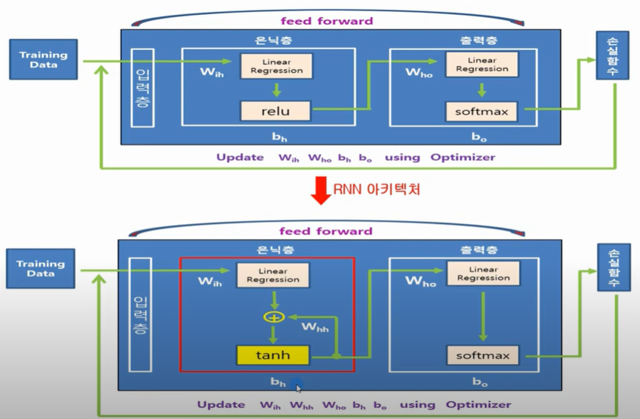
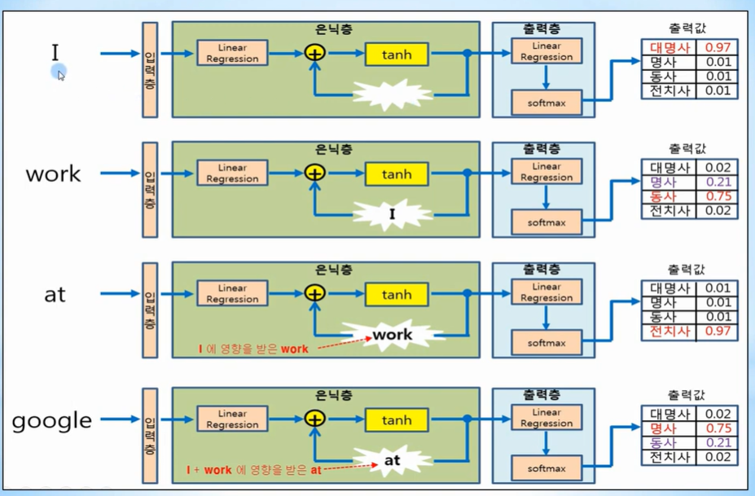
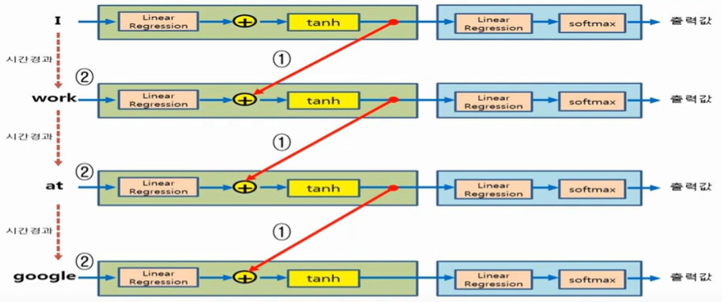
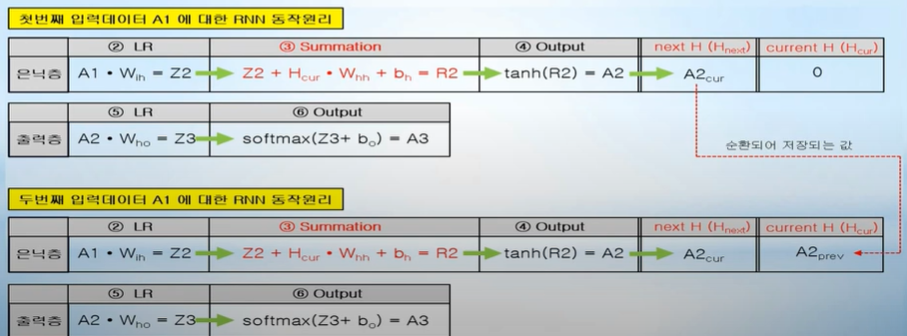
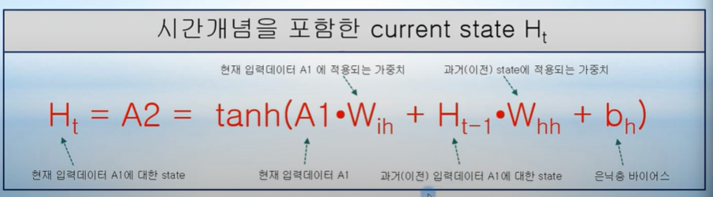

# Day08_RNN


- ### 아키텍처 비교 (NN vs RNN)

- 

- RNN에서는 은닉층에서 relu함수를 쓰지 않고 tanh 함수를 hyperblic tangent 함수를 이용하여 은닉층의 출력값을 계산하고 출력층으로 보낸다.
- RNN의 가장 큰 특징은 순환구조가 은닉층에 있다는 점이다.
- 출력값을 계산하여 출력층으로 보내는 동시에 순환하여 은닉층 입력으로 넣는다.


- ### RNN (Recurrent Neural Network 순환 신경망)

  - 내부적으로 순환 되는 구조를 이용한다.

  - 순서가 있는 데이터를 처리하는데 강점을 가진 신경망이다.

  - #### 순서(sequence)가 있는 데이터

    - 문장이나 음성 같은 연속적인 데이터를 말하는데, 이런 데이터는 문장에서 놓여진 위치에 따라 의미가 달라지는 것을 알 수 있다.
    - 즉, 현재 데이터 의미를 알기 위해서는 이전에 놓여 있는 과거 데이터도 알고 있어야 한다.
      ex) I work / I google [대명사 + 동사], at google / at work [전치사 + 명사]
    - 그래서 RNN은 이러한 과거의 데이터를 알기 위해서
      1. 은닉층내에 순환 구조를 이용하여 과거의 데이터를 기억해 두고 있다가
      2. 새롭게 입력으로 주어지는 데이터와 은닉층에서 기억하고 있는 과거 데이터를 연결 시켜서 그 의미를 알아내는 기능을 가지고 있다.

  - 

  - #### 시간 개념을 포함한 RNN 구조

    - 
    - 순환 구조를 은닉층에서 기억하는 과거의 데이터와 일정 시간이 지난 후에 입력되는 데이터에 연결시켜 주는 구조로 바꾸어서 생각해볼 수 있다.
    - 즉, 문장이나 음성 같은 순서가 있는 데이터라는 것은, 시간의 경과에 따라서 데이터가 순차적으로 들어온다는 것과 같은의미이다. 

  - 바이어스는 각 층에서 오직 1개의 값으로 정의될 수 있으나, 가중치는  층으로 입력되는 데이터의 개수만큼 정의되는 것을 알 수 있다.

  - RNN에서의 은닉층에서는 출력값이 순환하기 때문에 입력값이 2개라는 것을 알 수 있다.

  - #### 바이어스

    - 바이어스는 각각의 층마다 1개씩 있어야 하므로 은닉층에서의 바이어스와 출력층에서의 바이어스 총 2개가 있다.

  - #### 가중치

    - 은닉층에 입력되는 데이터 A1에 대해 적용되는 가중치는 W_ih이며 은닉층 내부적으로 순환구조를 이용하여 기억하고 있는 과거 데이터 H에 적용되는 가중치는 W_hh로 정의한다.
    - 출력층의 입력 데이터 A2에 적용되는 가중치는 W_ho 1개만 있다는 것을 알 수 있다.

  - 시간 개념을 포함한 current state H_t

    - 순환구조를 가지는 은닉층 출력값을 시간 개념을 포함한 현재상태로 표현한다면, 다음과 같이 나타낼 수 있다.
    - 
  


- ### Tensorflow를 이용한 RNN 정의

  - 은닉층에서 사용하는 API 

    - tf.contrib.rnn.BasicRNNCell()
      - Tensorflow 2.0에서 BasicRNNCell은 tf.keras.layers.SimpleRNNCell()로 대체
    - tf.nn.dynamic_rnn()

  - 출력층에서 사용하는 API

    - tf.contrib.seq2seq.sequence_loss()

  - #### 은닉층

    - cell = tf.contrib.rnn.BasicRNNCell(num_units=hidden_size)
      - hidden_size : 내부 순환구조를 가지고 있는 은닉층에서 one-hot으로 표현되는 출력 크기를 나타낸다.
      - 리턴값 cell : 입력으로 주어진 hidden_size를 가지는 은닉층 객체 cell을 리턴한다.
    - outputs, _states = tf.nn.dynamic_rnn(cell, x_data, initial_state, dtype=tf.float32)
      - cell : BasicRNNCell()의 리턴값인 은닉층 객체 cell
      - x_data : 순서를 가지고 있는 입력데이터. (sequence data로서 placeholder 형태로 주어진다.)
      - initial_state : 은닉층 객체인 cell 초기상태로서 일반적으로 zero 값으로 초기화 시킨다.
      - 리턴값 outputs, _states : 은닉층 출력 H_t와 상태를 각각 outputs과 _states로 리턴하지만 실제 outputs 만 주로 사용된다.

  - #### 출력층

    - seq_loss = tf.contrib.seq2seq.sequence_loss(logits=outputs, targets=label, weights=weights)
      - outputs : dynamic_rnn()의 리턴값인 outputs (은닉층 출력 값 H_t를 나타낸다.)
      - label : 정답데이터를 나타내며 일반적으로 placeholder 형태로 주어진다.
      - weights : 일반적으로 다음과 같이 1로 초기화된 텐서로 주어진다.(tf.ones([batch_size, sequence_length]))
      - 리턴값 seq_loss : sequence data에 대한 크로스엔트로피 오차를 리턴한다.

  - #### 노드 / 연산 정의 (입력데이터 gohom => 정답 데이터 ohome)

    1. 학습 데이터를 구성하고 있는 unique 문자를 숫자로 나타낸 후, 이러한 수수자를 one-hot 방식으로 변환하는 것이 순서가 있는 데이터를 학습하는 RNN에서 일반적인 방법이다.
    2. BasicRNNCell()을 이용하여 은닉층 출력 크기가 5인 은닉층 객체 cell을 생성한 후, dynamic_rnn()을 이용하여 cell 출력 값 H_t를 계산하여 outputs으로 리턴한다.
    3. seq2seq.sequence_loss()를 이용하여 크로스 엔트로피 손실함수를 계산 한 후, 손실함수 seq_loss가 최소가 되도록 AdamOptimizer를 이용하여 은닉층과 출력층 각각의 가중치와 바이어스 업데이트를 수행한다.

  - ``` python
    import tensorflow as tf
    import numpy as np
    
    # 'gohome' Data Creation
    idx2char = ['g', 'o', 'h', 'm', 'e'] 
    
    x_data = [[0, 1, 2, 1, 3]] # gohom
    
    x_one_hot = [[[1. 0. 0. 0], # g 0
                  [0, 1, 0, 0], # o 1
                  [0, 0, 1, 0], # h 2
                  [0, 1, 0, 0], # o 1
                  [0, 0, 0, 1]]] # m 3
    
    t_data = [[1, 2, 1, 3, 4]] # ohome
    
    num_classes = 5
    input_dim = 4
    hidden_size = 5 
    batch_size = 1
    sequence_length = 5
    learning_rate = 0.1
    
    X = tf.placeholder(tf.float32, [None, sequence_length, inpu_dim])
    T = tf.placeholder(tf.int32, [None, sequence_length])
    
    cell = tf.contrib.BasicRNNCell(num_units=hidden_size)
    
    initial_state = cell.zero_state(batch_size, tf.float32)
    
    outputs, _states = tf.nn.dynamic_rnn(cell, X, initial_state=initial_state, dtype=tf.float32)
    
    weights = tf.ones([batch_size,sequence_length])
    
    seq_loss = tf.contrib.seq2seq.sequence_loss(logits = outputs, targets = T, weights = weights)
    
    loss = tf.reduce_mean(seq_loss)
    
    train = tf.train.AdamOptimizer(learning_rate = learning_rate).minimize(loss)
    ```

    